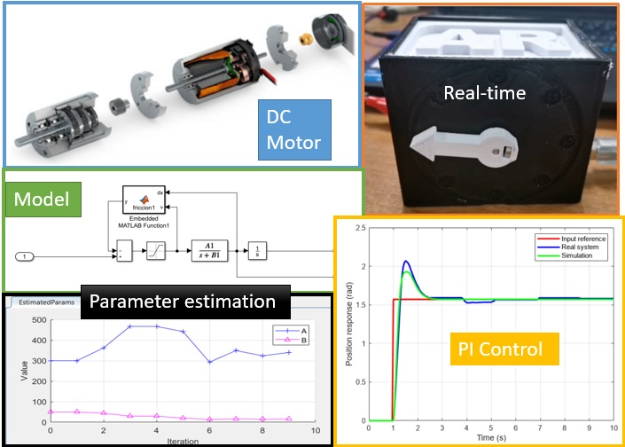

# Intelligent-Control-Systems-Course-Curriculum by Asst. Prof. Claudia Fernanda YAŞAR

# Description

This teaching package introduces the Intelligent Control Systems Curriculum using MATLAB Live Scripts, PDFs, and supporting videos. Topics include model-based vs. data-driven systems, computational tools, dynamical modeling, machine learning, deep learning, model predictive control, extremum seeking control, model reference adaptive control, and fuzzy logic control strategies supported by performance evaluation. This course has been designed for both undergraduate and postgraduate Control and Automation Engineers. 
Some practical experiments are carried out with Arduino-based and low-cost hardware, including the TC-lab (with heaters and temperature sensors), a DC micro gear motor with an encoder using the L298N Dual H-Bridge, and image processing using a webcam. Some videos support the datasets of many experiments and illustrate systems results to evaluate performances enhancing the learning experience. 

The package consists of a series of MATLAB [Live Scripts](https://www.mathworks.com/products/matlab/live-editor.html) with complementary material. 

[MATLAB](https://www.mathworks.com/products/matlab.html) is a programming and numeric computing platform developed by MathWorks.

# Examples 

|  Solving XOR problem with Multilayer Perceptron | 

# Instructions
The teaching materials can be approached by following each of the required subjects one by one and studying the presented Material.

## Live Scripts
The instructions inside the Live Scripts will guide you through the activities and examples. We suggest running each section within a Live Script individually. Use the Interactive Live Script and experiment with their suggested material and additional hyperlinks that provide additional information. 

## PDFs Material
Some subjects can also be approached by following presentations that will provide links to complementary resources.

## Experimental Platforms
This teaching package employs Arduino-based, low-cost hardware for hands-on experiments. The platforms include the [TC-lab](https://apmonitor.com/pdc/index.php/Main/ArduinoTemperatureControl) with two heaters and temperature sensors, a DC micro gear motor, and image processing using a webcam. These setups allow students to use and evaluate datasets, providing practical experience in intelligent control systems.

## Videos 
Recorded experiments are utilized to collect and create our datasets, allowing for detailed evaluation and comparison of performance across various subjects within the curriculum [ControlTech lab](https://www.youtube.com/channel/UC4HUYU5zKblBf-LD-CjEDWA).

# Contents
Live Scripts with complementary material are available in folders containing the following sections:

## Introduction to Intelligent Control
1. [Computational Thinking Tools](https://www.mathworks.com/matlabcentral/fileexchange/164221-computational-thinking-tools)

## Dynamical Systems Modeling
2. [DC-Motor-Dynamics-Modeling-and-Position-Control](https://www.mathworks.com/matlabcentral/fileexchange/164976-dc-motor-dynamics-modeling-and-position-control)
3. [Single-Heater-Response](https://www.mathworks.com/matlabcentral/fileexchange/164206-single-heater-response)
4. [First-Order-Plus-Dead-Time-Models](https://www.mathworks.com/matlabcentral/fileexchange/167976-first-order-plus-dead-time-models)
5. [Coastline-Prediction-Using-Climate-Change-Models](https://www.mathworks.com/matlabcentral/fileexchange/168136-coastline-prediction-using-climate-change-models)

## Data-driven Modeling
6. [Semi-Empirical-Model-Estimation-Regression](https://www.mathworks.com/matlabcentral/fileexchange/167986-semi-empirical-model-estimation-regression)
7. [Machine-Learning-Classification-with-Experiments](https://www.mathworks.com/matlabcentral/fileexchange/167851-machine-learning-classification-with-experiments)
8. [Deep Learning and Yolov2 for Object Classification](https://www.mathworks.com/matlabcentral/fileexchange/168121-deep-learning-and-yolov2-for-object-classification)
9. [Python-and-MATLAB-RRN-LSTM-Model-for-Prediction-and-Forecast](https://www.mathworks.com/matlabcentral/fileexchange/168131-python-and-matlab-rrn-lstm-model-for-prediction-and-forecast)

## Model-driven and Data-driven Control
10. [Model Predictive Control for DC Motor Positioning](https://www.mathworks.com/matlabcentral/fileexchange/165701-model-predictive-control-for-dc-motor-positioning)
11. [Model-Reference-Adaptive-Control](https://www.mathworks.com/matlabcentral/fileexchange/165477-model-reference-adaptive-control)
12. [Extremum-Seeking-Control-Mass-Spring-Damper-System](https://www.mathworks.com/matlabcentral/fileexchange/168021-extremum-seeking-control-mass-spring-damper-system)
13. [DC-Motor-Position-with-Fuzzy-Logic-Control](https://www.mathworks.com/matlabcentral/fileexchange/167991-dc-motor-position-with-fuzzy-logic-control)

# Learning Goals
- Learn the fundamentals behind intelligent control system design to handle complex systems 
- Acquire knowledge and skills in the latest technology trends and technical computing for Model-Based Design and control with MATLAB and Simulink 
- Utilize computationally efficient tools to analyze dynamics and control systems, enabling the evaluation of the practical considerations for both experimental or simulated control systems 
- Engage in project-based learning to complete a specific project, assess system performance, and have a  comprehensive understanding of various data-driven modeling, data-driven methodologies, and  data-driven control applications

# Suggested Pre-work
This course does not assume any prior knowledge of neural networks, machine learning or AI. However, it is designed for students from basic sciences or related engineering fields.

- [MATLAB Onramp](https://matlabacademy.mathworks.com/details/matlab-onramp/gettingstarted) - Introductory tutorial on commonly used features and workflows.
- [Simulink Onramp](https://matlabacademy.mathworks.com/details/simulink-onramp/simulink) - Learn the basics of how to create, edit, and simulate models in Simulink. Use block diagrams to represent real-world systems and simulate components and algorithms.
- [Control Design Onramp with Simulink](https://matlabacademy.mathworks.com/details/control-design-onramp-with-simulink/controls)- Adjust the gains of a PID controller to change the dynamics of a physical system and get the desired closed-loop system behaviour.
- [Machine Learning Onramp](https://matlabacademy.mathworks.com/details/machine-learning-onramp/machinelearning) - An interactive introduction to practical machine learning methods for classification problems.
- [Deep Learning Onramp](https://matlabacademy.mathworks.com/details/deep-learning-onramp/deeplearning)- Provides an interactive introduction to practical deep learning methods. You will learn to use deep learning techniques in MATLAB for image recognition.
- [Reinforcement Learning Onramp](https://matlabacademy.mathworks.com/details/reinforcement-learning-onramp/reinforcementlearning) - Add a reinforcement learning agent to a Simulink® model and use MATLAB to train it to choose the best action in a given situation.

# Products
MATLAB, Statistics and Machine Learning Toolbox™, Deep Learning Toolbox™ , Control System Toolbox™, Model Predictive Control Toolbox™

# Acknowledgements
I would like to express my gratitude to the students of the Intelligent Control Systems course of the YTÜ Control and Automation Engineering department, Class 2022 and 2023, whose dedication and hard work made this project possible. I am also deeply thankful to our Control Tech LAB team, Doctors Marco Rossi, and Melda Ulusoy for their invaluable contributions.

